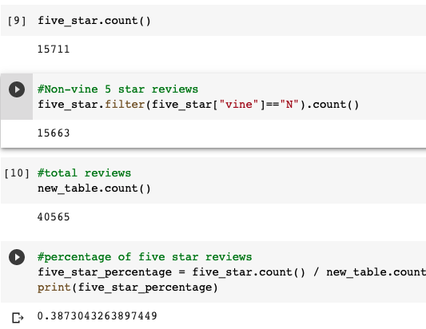
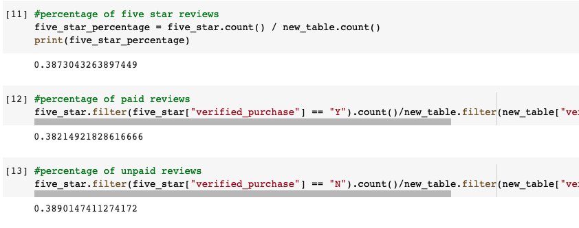

# Amazon_Vine_Analysis

## Overview of The Analysis:
This project is an analysis of a data set from Amazon reviews regarding video games to see if there is favorable review bias from the Vine members within the data set. In order to accomplish this task, I used Pyspark to perform the ETL process by extracting the data, transforming the data and connecting to the database that I generated through the AWS webserver.

## Results
### How many Vine reviews and non-Vine reviews were there?

* There were a total of of 4,291 vine reviews in our dataset, and 40,471 non-vine reviews in the complete dataset.

### How many Vine reviews were 5 stars? How many non-Vine reviews were 5 stars?
* In the data set their was a total of 15,711 5-star reviews
* 15,663 of the 5-star reviews were non-vine members

### What percentage of Vine reviews were 5 stars? What percentage of non-Vine reviews were 5 stars?
* 38.2% of the five_star reviews were vine
* 38.9% of the five_star reviews were non-vine

## Summary
In conclusion, our analysis indicates that there does not appear to be any sort of positivity bias from the Vine Program. This is due to the fact that the percentages shown above are very similar at 38%.
